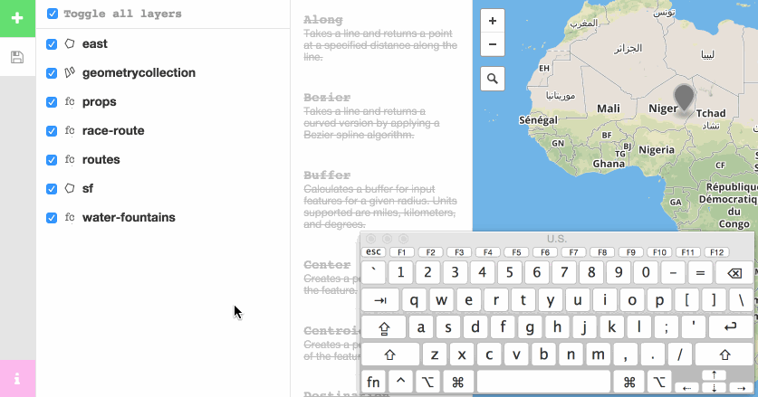

# dropchop
 

**You drop. We chop.**

Dropchop is a browser-based GIS powered by [Mapbox.js](http://mapbox.com/mapbox.js) and [Turf.js](http://turfjs.org). The need for small-scale GIS operations comes up quite frequently in our work, especially for those without much time. Dropchop aims to empower your spatial data by removing complexity. This project is currently a proof-of-concept and explores [three hypotheses](https://github.com/cugos/dropchop/wiki/Dropchop-Inspiration):

1. **GIS can be data-first, not operation-first.**
2. **GIS doesn't always require a server.**
3. **GIS is open.**

## User's Manual

### Adding Data

##### Upload

You can upload your own files via *click-and-drag* or *selecting files on your computer* using the system dialogue. File types allowed are `.json` (assuming valid TopoJSON or GeoJSON), `.geojson`, `.topojson`, Shapefiles in `.zip` format.

##### Open Street Map

Dropchop allows you to import [OpenStreetMap](http://www.openstreetmap.org/) data via the [Overpass API](http://wiki.openstreetmap.org/wiki/Overpass_API) query language. Selecting this option queries the OSM planet database and will add successful responses as layers to your project. *Note: this feature is still a prototype, and doesn't work fully as expected. See [issue 189](https://github.com/cugos/dropchop/issues/189) for a reference.*

##### Gist

To turn data from a [Gist](http://gist.github.com/) into dropchop layers, you can upload via the tool option or include the Gist `ID` in the URL like this `http://dropchop.io/?gist=09129c20ec020b83bf85`. Gist is a great way to store you data and save it for later.

##### URL

External URL's that are valid geometry can be uploaded in a similar fashion to Gists. Use the tool option in dropchop or include in your URL parameters like `https://gist.githubusercontent.com/mapsam/32610a73cb84ba693bac/raw/b849594c6fff0ab054c341bb5da1c4c95e87fb5a/map.geojson`

##### ArcGIS Server Feature Service

##### User Location

### Exporting Data

##### GeoJSON

##### TopoJSON

##### Shapefile

### Keyboard Shortcuts

Dropchop is built with a limited set of keyboard shortcuts:

Keystroke | Action
---: | ---
<kbd>cmd</kbd> + <kbd>a</kbd>, <kbd>ctrl</kbd> + <kbd>a</kbd> | Select All
<kbd>cmd</kbd> + <kbd>backspace</kbd>, <kbd>ctrl</kbd> + <kbd>backspace</kbd> | Deselect All
<kbd>cmd</kbd> + <kbd>+</kbd>, <kbd>ctrl</kbd> + <kbd>+</kbd> | Check All
<kbd>cmd</kbd> + <kbd>-</kbd>, <kbd>ctrl</kbd> + <kbd>-</kbd> | Uncheck All
<kbd>ctrl</kbd> + <kbd>shift</kbd> + <kbd>k</kbd> | Delete selected layers

## Who?

All of this work is made possible by [CUGOS](http://cugos.org), an open-source geo community based in Seattle.

## Contribute!

Information on contributing to Dropchop (including project installation instructions) can be found in the [CONTRIBUTING.md file](CONTRIBUTING.md). Dropchop is now officially in `0.1`, which means progress is stable and contributions are welcomed with open arms. For starters, take a look at how we are using ["triggers"](CONTRIBUTING.md#triggers) to execute commands across the code base.

If you're interested in any of the above, please help out! Submit ideas as [issues](https://github.com/cugos/dropchop/issues), work on [bugs](https://github.com/cugos/dropchop/labels/bug), add new [features](https://github.com/cugos/dropchop/labels/enhancement). Here's to [our contributors](https://github.com/cugos/dropchop/graphs/contributors)!

Things are moving very quickly with the project right now. We are still continuing to build out and refactor the architecture of the application. If you want to read more about our decision-making process take a look at some of our meeting notes. [04/11/2015](https://github.com/cugos/dropchop/wiki/Meeting-Notes---04-11-2015), [05/10/2015](https://github.com/cugos/dropchop/wiki/Meeting-Notes-05-10-2015).

---

*Once you drop the chop don't stop.*

